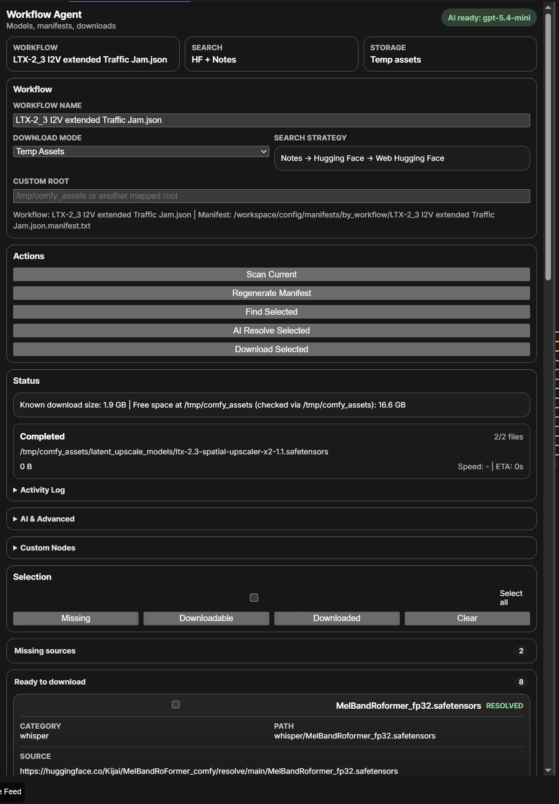

# ComfyUI Workflow Asset Agent



Manifest-first workflow resolver and downloader for ComfyUI.

It scans the currently opened workflow, extracts referenced models, keeps a reusable manifest per workflow, resolves sources with a Hugging Face-first strategy, and downloads assets into the correct ComfyUI folders or a temporary asset root.

## Features

- Scan the active workflow and build a manifest
- Reuse existing manifests for known workflows
- Detect workflow renames and offer manifest migration
- Search workflow notes first, then Hugging Face API, then Hugging Face web
- Optional AI ranking with OpenAI-compatible APIs
- Download into temp assets or a custom mapped root
- Run disk preflight before queuing downloads
- Show real per-file download progress for direct downloads
- Download individual resolved entries with one click
- Install or update custom nodes from GitHub in the same panel

## Search Strategy

This public bundle is intentionally Hugging Face first.

- Workflow notes and related Hugging Face links are preferred
- Hugging Face API search is used next
- Hugging Face web discovery is used as a final fallback
- Civitai is disabled in the default shipped settings

## Repository Layout

```text
custom_nodes/ComfyUI-WorkflowAssetAgent/
scripts/
config/models/
config/manifests/examples/
docs/
install_to_comfyui.py
```

## What is included

- `custom_nodes/ComfyUI-WorkflowAssetAgent`
  Sidebar extension and backend routes
- `scripts/download_assets.py`
  Streaming downloader used by the node and by standalone manifests
- `scripts/workflow_to_manifest.py`
  Helper for building manifests from workflow JSON
- `config/models/model_aliases.json`
  Alias patterns for fuzzy filename matching
- `config/models/popular_models.json`
  Curated direct source map for common models
- `install_to_comfyui.py`
  Cross-platform installer for local ComfyUI or RunPod workspaces

## Installation

### Local ComfyUI

```bash
python install_to_comfyui.py --comfy-root /path/to/ComfyUI
```

Windows example:

```powershell
python .\install_to_comfyui.py --comfy-root "D:\ComfyUI-Easy-Install\ComfyUI-Easy-Install\ComfyUI"
```

### RunPod style workspace

```bash
python install_to_comfyui.py --comfy-root /workspace/ComfyUI --workspace-root /workspace
```

Installer actions:

- copies the custom node into `custom_nodes/ComfyUI-WorkflowAssetAgent`
- copies shared scripts into `<workspace>/scripts`
- copies reusable config into `<workspace>/config/models`
- creates `workflow_asset_agent_settings.json` if it does not already exist

## Environment variables

Create a local `.env` or export variables in your shell:

```env
OPENAI_API_KEY=
HF_TOKEN=
```

- `OPENAI_API_KEY` is only required for AI resolve
- `HF_TOKEN` is optional but useful for gated Hugging Face repos
- `.env` is intentionally excluded from git

## Settings

Example template:

- `config/models/workflow_asset_agent_settings.example.json`

Runtime file:

- `config/models/workflow_asset_agent_settings.json`

The runtime settings file is ignored by git because it is user state.

## Generated data

These are generated at runtime and usually should not be committed:

- `config/models/model_registry.json`
- `config/manifests/by_workflow/`
- `config/manifests/generated_runtime/`
- `logs/`

See [docs/MANIFESTS.md](docs/MANIFESTS.md).

## Notes before publishing

Before publishing or reusing this bundle, review:

- `README.md`
- `.env.example`
- `config/models/popular_models.json`

so the public package matches the sources and naming you want to ship.

## Don@tes

**If any of this turns out to be useful for you - I'm glad.  
And if you feel like supporting it:  
☕ 1-2 coffees are more than enough ☺️**

[Click to Buy me a Coffee](https://buymeacoffee.com/natlrazfx)
[Subscribe me on Substack](https://substack.com/@natalia289425)

## Status

This repository is meant to be a reusable public bundle of the Workflow Asset Agent toolchain, not a dump of a private ComfyUI workspace.
